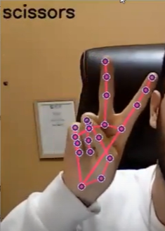
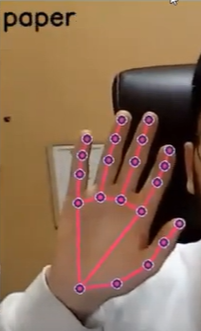
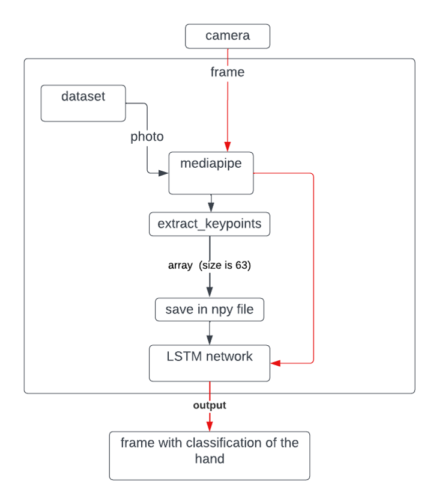

# <h1 align="center"> Rock-paper-scissors </h1>
<h4 align="center"> A system for computer vision, enabling real-time detection, identification, and classification of human hands.</h4>
  

 
  
  

  

## Introduction
The project's objective is to develop a computer vision system capable of real-time detection, identification, and classification of human hands, including recognizing hand gestures such as rock, paper, and scissors as captured by the camera.
The project utilizes Jupyter Notebook and Python programming language for documentation and code execution, while MediaPipe library is employed for real-time hand tracking.
Additionally, TensorFlow and Keras libraries are utilized to create and train the model for analyzing a vast database of images, with sklearn library being applied for statistical analysis and data processing.

## Implementation plan - graphic scheme

 
   

## Sources
- Database: https://www.kaggle.com/datasets/glushko/rock-paper-scissors-dataset 
- mediapipe (hands): https://google.github.io/mediapipe/solutions/hands
- video 1: https://youtu.be/doDUihpj6ro?si=t3LoIOYMBeWeErGz
- video 2: https://youtu.be/vQZ4IvB07ec?si=bEZhoRY6F3ElAwqP

# 

 <h1 align="center">SUBMITTED BY </h2>
<h2 align="center">ALAA TRABLSE  
  </h1>
